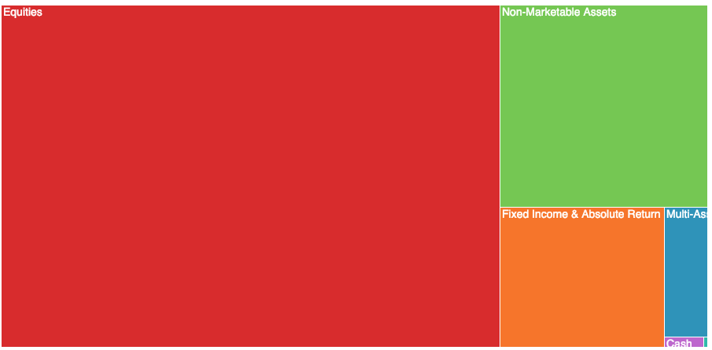

#  Treemap

This diagram creates a [treemap](https://en.wikipedia.org/wiki/Treemapping) to display hierarchical data in a nested structure.

### Setup - Clone Repo

1. Click **Clone or Download**.
2. In the Clone with HTTPs section, click the clipboard icon to copy the clone URL for the repository.
3. Open Terminal.
4. Change the current working directory to the location where you want the cloned directory to be made.
5. Type `git clone`, and then paste the URL you copied in Step 2.
	* `$ git clone https://github.com/YOUR-USERNAME/YOUR-REPOSITORY`
6. Press **Enter**. Your local clone will be created.

### Setup - Local Dev

1. Open Terminal.
2. Change the current working directory to the location where the project files are stored.
3. Type `npm run-script start:dev`
4. Press **Enter**. Project will build and start running on https://localhost:3443/treemap.js

You can use this URL in your Looker instance during development.

### Production - Build

1. Open Terminal.
2. Change the current working directory to the location where the project files are stored.
3. Type `npm run-script build`
4. Press **Enter**. Project will build and publish to `PROJECT_FOLDER\dist\treemap.js`

### Production - Github Hosted Page

1. Navigate to your github account. `https://github.com/YOUR_USERNAME`
2. Click **New**
3. In *Repositoy Name*, Enter `YOUR_USERNAME.github.io`. (ex. bytecodeio.github.io)
4. Enter a description.
5. Check box on *Initialize this repository with a README*.
6. Click **Create Repository**
7. Upload `treemap.js` to this repository and commit.

***NOTE: Even if you mark this repository as private, the files within it are public and accessible to anyone.***

Your custom visualization is now hosted on github. `https://YOUR_USERNAME.github.io/treemap.js`

You can use this URL in your Looker instance for production.
